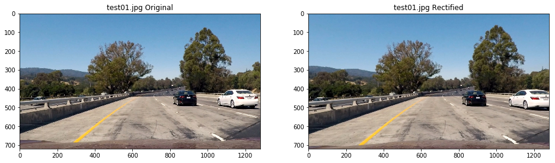
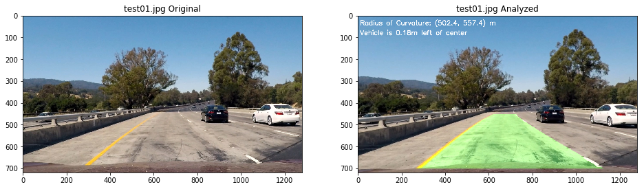

## README

### Technical Report for Advanced Lane Line Detection.

---

**Advanced Lane Finding Project**

The goals of this project are the following:

* Compute the camera calibration matrix and distortion coefficients given a set of chessboard images.
* Apply a distortion correction to raw images.
* Use color transforms, gradients, etc., to create a thresholded binary image.
* Apply a perspective transform to rectify binary image ("birds-eye view").
* Detect lane pixels and fit to find the lane boundary.
* Determine the curvature of the lane and vehicle position with respect to center.
* Warp the detected lane boundaries back onto the original image.
* Output visual display of the lane boundaries and numerical estimation of lane curvature and vehicle position.

---

### Camera Calibration

#### 1. Briefly state how you computed the camera matrix and distortion coefficients. Provide an example of a distortion corrected calibration image.

The code for image rectification is contained in the module [lane_line_detection.rectifiers](lane_line_detection/rectifiers/rectify.py).

The whole procedure is wrapped up as a sklearn Transformer subclass as follows:

```python
class DistortionRectifier(TransformerMixin):
    """ Distortion rectification transformer for single view camera
    """

    def __init__(
        self,
        images_descriptor
    ):
        self.camera_matrix = None
        self.dist_coeffs = None

        # Get object and image points:
        (obj_points, img_points, img_shape) = self._get_object_and_image_points(
            images_descriptor
        )

        # Calibrate:
        if not img_shape is None:
            status_code, camera_matrix, dist_coeffs, rotations, translations = cv2.calibrateCamera(
                obj_points,
                img_points,
                img_shape,
                None,
                None
            )
            self.camera_matrix = camera_matrix
            self.dist_coeffs = dist_coeffs

    def transform(self, X):
        """ Undistort input image
        """
        return cv2.undistort(
            X,
            self.camera_matrix,
            self.dist_coeffs
        )

    def fit(self, X, y=None):
        """ Estimate camera matrix
        """
        return self

    def set_params(self, **kwargs):
        self.__dict__.update(kwargs)
```

First, the object-image point pairs are extracted from calibration images in [camera calibration](camera_calibration). Since all the object points in each calibration image are just planar points, here I fix all their z coordinates as 0. All the object points are indexed in left-to-right, top-to-bottom manner. Since the geometric structure of camera calibration scene does not matter to us, the unit of object point indexing is simply set as 1.

After the object-image point pairs are prepared, image rectification coefficients are attained through calling cv2.calibrateCamera.

The undistort transformation is implemented in class's transform method.

One example of distortion corrected calibration image is as follows:


### Pipeline (single images)

#### 1. Provide an example of a distortion-corrected image.

One example of distortion corrected test image is as follows:





#### 2. Describe how (and identify where in your code) you used color transforms, gradients or other methods to create a thresholded binary image.  Provide an example of a binary image result.

I used a combination of color and gradient thresholds to generate a binary image.

The whole procedure is wrapped up as a sklearn Transformer subclass and is contained in the module [lane_line_detection.binarizers](lane_line_detection/binarizers/binarize.py).

Below is the code snippet.

```python
class Binarizer(TransformerMixin):
    """ Transform input image to thresholded binary image based on gradient magnitude
    """
    def __init__(
        self,
        image_size,
        ROI,
        yellow_lane_hue_thresholds,
        yellow_lane_saturation_thresholds,
        white_lane_saturation_thresholds,
        white_lane_value_thresholds,
        gradient_kernel_size,
        gradient_thresholds,
        morphology_kernel_size
    ):
        # ROI:
        self.ROI = get_ROI_mask(image_size, ROI)

        self.yellow_lane_hue_thresholds = yellow_lane_hue_thresholds
        self.yellow_lane_saturation_thresholds = yellow_lane_saturation_thresholds

        self.white_lane_saturation_thresholds = white_lane_saturation_thresholds
        self.white_lane_value_thresholds = white_lane_value_thresholds

        self.gradient_kernel_size = gradient_kernel_size
        self.gradient_thresholds = gradient_thresholds

        self.morphology_kernel = np.ones(
            (morphology_kernel_size,morphology_kernel_size),
            np.uint8
        )

    def transform(self, X):
        """ Binarize input image
        """
        # Convert to HSV:
        HSV = cv2.cvtColor(
            X, cv2.COLOR_BGR2HSV
        )

        # Split components:
        H, S, V = cv2.split(HSV)

        # Colors:
        yellow_lane_mask = (
            get_channel_mask(H, self.yellow_lane_hue_thresholds) &
            get_channel_mask(S, self.yellow_lane_saturation_thresholds)
        )
        white_lane_mask = (
            get_channel_mask(S, self.white_lane_saturation_thresholds) &
            get_channel_mask(V, self.white_lane_value_thresholds)
        )

        # Gradients:
        grayscale = V
        grad_mask = get_gradient_mask(
            grayscale,
            'x',
            self.gradient_kernel_size,
            (self.ROI & (yellow_lane_mask | white_lane_mask)),
            self.gradient_thresholds
        )

        mask = self.ROI & ((yellow_lane_mask | white_lane_mask) | grad_mask)

        # Morphological filtering:
        mask = cv2.morphologyEx(
            mask,
            cv2.MORPH_CLOSE,
            self.morphology_kernel,
            iterations=3
        )

        return mask

    def fit(self, X, y=None):
        """ Do nothing
        """
        return self

    def set_params(self, **kwargs):
        self.__dict__.update(kwargs)
```

First, the lane lines in ROI are identified using combined hue-saturation filtering for yellow lane line, combined saturation-value for white lane lines and gradient-based filtering for lane line borders.

After that, a morphological close filtering is used to enhance the detected lane line pixels.

Here's an example output for this step.


#### 3. Describe how (and identify where in your code) you performed a perspective transform and provide an example of a transformed image.

The whole procedure is wrapped up as a sklearn Transformer subclass and is contained in the module [lane_line_detection.transformers](lane_line_detection/transformers/transform.py).

Below is the code snippet:

```python
class PerspectiveTransformer(TransformerMixin):
    """ Distortion rectification transformer for single view camera
    """

    def __init__(
        self,
        src_points,
        dst_points,
        frame_size
    ):
        # Get transform & inverse transform matrix:
        src_points = np.float32(
            src_points
        )
        dst_points = np.float32(
            dst_points
        )
        # Forward:
        self.M_scene_to_laneline = cv2.getPerspectiveTransform(
            src_points,
            dst_points
        )
        # Inverse:
        self.M_laneline_to_scene = cv2.getPerspectiveTransform(
            dst_points,
            src_points
        )
        # Frame size:
        self.frame_size = frame_size

    def transform(self, X):
        """ Map from scene plane to lane-line plane
        """
        return cv2.warpPerspective(
            X,
            self.M_scene_to_laneline,
            self.frame_size,
            cv2.INTER_NEAREST
        )

    def inverse_transform(self, y):
        """ Map from lane-line plane to scene plane
        """
        return cv2.warpPerspective(
            y,
            self.M_laneline_to_scene,
            self.frame_size,
            cv2.INTER_LINEAR
        )

    def fit(self, X, y=None):
        """ Estimate camera matrix
        """
        return self

    def set_params(self, **kwargs):
        self.__dict__.update(kwargs)
```

First, I identify the four-point source-destination pixel coordinates pair based on the annotation result analysis of the two straight-line images using annotation tool [Sloth](https://github.com/cvhciKIT/sloth)

The final source and destination point pairs are as follows:

| Source        | Destination   |
|:-------------:|:-------------:|
|  689.1, 452.1 | 960,     1    |
|  594.2, 452.1 | 320,     1    |
|  246.5, 696.8 | 320,   718    |
| 1069.7, 696.8 | 960,   718    |

The meter to pixel coefficients for this mapping are as follows:

| Coordinate    | Value         |
|:-------------:|:-------------:|
|       X       |    3.7/640    |
|       Y       |   38.0/717    |

The source points on the straight line annotation image and its warped counterpart are as follows.


The transformed test images are as follows.


#### 4. Describe how (and identify where in your code) you identified lane-line pixels and fit their positions with a polynomial?

The whole procedure is wrapped up as a sklearn Transformer subclass and is contained in the module [lane_line_detection.analyzers](lane_line_detection/analyzers/analyze.py).

Below is the code snippet:

```python
class Analyzer(TransformerMixin):
    def __init__(
        self,
        window_size,
        offset,
        meter_per_pixel,
    ):
        self.window_size = window_size
        self.offset = offset
        self.meter_per_pixel = meter_per_pixel

    def transform(self, X):
        """ Binarize input image
        """
        # Get left & right lane line masks:
        lane_masks = get_left_and_right_lane_masks(
            X,
            self.window_size,
            self.offset
        )

        if are_both_lane_lines_detected(X, lane_masks):
            return get_params(
                X,
                lane_masks,
                self.meter_per_pixel
            )

        return None

    def fit(self, X, y=None):
        """ Do nothing
        """
        return self

    def set_params(self, **kwargs):
        self.__dict__.update(kwargs)
```

First, the two lane line masks are generated using convolutional analysis of thresholded image. The detailed implementation is contained in [lane_line_detection.analyzers.utils.get_left_and_right_lane_masks](lane_line_detection/analyzers/utils.py).

After that, two second order polynomials are fitted [lane_line_detection.analyzers.utils.get_lane_line_params](lane_line_detection/analyzers/utils.py).

#### 5. Describe how (and identify where in your code) you calculated the radius of curvature of the lane and the position of the vehicle with respect to center.

The radius of curvatures and vehicle offset with respect to center are calculated in the module [lane_line_detection.analyzers.utils](lane_line_detection/analyzers/utils.py).

Please refer to the two functions, namely:

1. [lane_line_detection.analyzers.utils.get_curverads](lane_line_detection/analyzers/utils.py).

2. [lane_line_detection.analyzers.utils.get_offset](lane_line_detection/analyzers/utils.py).

for mathematical details.

#### 6. Provide an example image of your result plotted back down onto the road such that the lane area is identified clearly.

The whole procedure is wrapped up as a sklearn Transformer subclass and is contained in the module [lane_line_detection.painters](lane_line_detection/painters/paint.py).

Below is the code snippet:

```python
class Painter:
    def __init__(
        self,
        transformer
    ):
        self.transformer = transformer

    def transform(
        self,
        canvas,
        lane_line_params,
        curverads,
        offset
    ):
        # Parse lane line params:
        (left_lane_line_params, right_lane_line_params) = lane_line_params

        # Identify lane region:
        H, W, _ = canvas.shape
        y = np.linspace(0, H-1, H).astype(np.int)
        Y = np.vstack(
            (y**2, y, np.ones_like(y))
        )
        left_lane_line_x = np.dot(left_lane_line_params, Y).astype(np.int)
        right_lane_line_x = np.dot(right_lane_line_params, Y).astype(np.int)

        left_lane_line_points = np.vstack((left_lane_line_x, y)).T
        right_lane_line_points = np.flipud(np.vstack((right_lane_line_x, y)).T)
        lane_line_polygon = np.vstack(
            (left_lane_line_points, right_lane_line_points)
        )

        # Generate overlay:
        overlay = self.transformer.inverse_transform(
            cv2.fillPoly(
                np.zeros((H, W, 3), dtype=np.uint8),
                [lane_line_polygon],
                (0, 255, 0)
            )
        )

        # Add lane region:
        processed = cv2.addWeighted(
            canvas, 1, overlay, 0.3, 0
        )
        # Add curverads:
        (left_curverad, right_curverad) = curverads
        cv2.putText(
            processed,
            "Radius of Curvature: ({:.1f}, {:.1f}) m".format(
                left_curverad, right_curverad
            ),
            (10,45),
            cv2.FONT_HERSHEY_SIMPLEX,
            1,
            (255,255,255),
            2,
            cv2.LINE_AA
        )
        # Add offset:
        cv2.putText(
            processed,
            "Vehicle is {:.2f}m {} of center".format(
                abs(offset),"right" if offset < 0 else "left"
            ),
            (10,90),
            cv2.FONT_HERSHEY_SIMPLEX,
            1,
            (255,255,255),
            2,
            cv2.LINE_AA
        )

        return processed

    def fit(self, X, y=None):
        """ Do nothing
        """
        return self

    def set_params(self, **kwargs):
        self.__dict__.update(kwargs)
```

First, polygon definition for region between the two lane lines is generated through extrapolation of the two lane lines.

Then the lane region overlay and curverads and offset overlay are added to the rectified image.

Here is the example outputs on test images:





---

### Pipeline (video)

#### 1. Provide a link to your final video output.  Your pipeline should perform reasonably well on the entire project video (wobbly lines are ok but no catastrophic failures that would cause the car to drive off the road!).

Here is the link to project and challenge video. [Advanced Lane Line Detection Demo](output_videos).

Temporal smoothing is used to optimize parameter estimation from consecutive video frames.

The temporal smoothing procedure is wrapped up as a sklearn Transformer subclass and is contained in the module [lane_line_detection.analyzers](lane_line_detection/analyzers/stream_analyze.py)

The code snippet is as follows:

```python
class StreamAnalyzer(TransformerMixin):
    def __init__(
        self,
        window_size,
        offset,
        meter_per_pixel,
        temporal_filter_len
    ):
        self.analyzer = Analyzer(
            window_size,
            offset,
            meter_per_pixel
        )
        self.queue = deque()
        self.temporal_filter_len = temporal_filter_len

        self._optimal = np.zeros(9)

    def transform(self, X):
        """ Binarize input image
        """
        # Get params of current frame
        params = self.analyzer.transform(
            X
        )

        if params is None:
            if len(self.queue) > 0:
                self.queue.popleft()
        else:
            # Parse params:
            (
                (
                    left_lane_line_params,
                    right_lane_line_params
                ),
                (
                    left_curverad, right_curverad
                ),
                offset
            ) = params

            if (
                self._is_valid_lane_params(
                    left_lane_line_params,
                    right_lane_line_params
                ) and self._is_valid_curverads(
                    left_curverad,
                    right_curverad
                )
            ):
                # Format as state vector:
                state = np.hstack(
                    (
                        left_lane_line_params,
                        right_lane_line_params,
                        left_curverad,
                        right_curverad,
                        offset
                    )
                )

                # Remove the outdated state:
                if len(self.queue) == self.temporal_filter_len:
                    self.queue.popleft()

                # Append:
                self.queue.append(state)
            else:
                if len(self.queue) > 0:
                    self.queue.popleft()

        # Update:
        if len(self.queue ) > 0:
            self._optimal = np.array(
                self.queue
            ).mean(axis = 0)

        return self._optimal_state_to_params()

    def fit(self, X, y=None):
        """ Do nothing
        """
        return self

    def set_params(self, **kwargs):
        self.__dict__.update(kwargs)

    def _optimal_state_to_params(self):
        return (
            (
                tuple(self._optimal[0:3]),
                tuple(self._optimal[3:6])
            ),
            tuple(self._optimal[6:8]),
            self._optimal[8]
        )

    def _is_valid_lane_params(
        self,
        left_lane_line_params,
        right_lane_line_params
    ):
        top_diff = (
            np.polyval(right_lane_line_params, 0) - np.polyval(left_lane_line_params, 0)
        )
        bottom_diff = (
            np.polyval(right_lane_line_params, 719) - np.polyval(left_lane_line_params, 719)
        )

        ratio = top_diff/ bottom_diff

        return (1/3 <= ratio) and (ratio <= 3)

    def _is_valid_curverads(
        self,
        left_curverad,
        right_curverad
    ):
        ratio = left_curverad / right_curverad

        return (1/4 <= ratio) and (ratio <= 4)
```

Average filtering is used to smooth the estimates.

Sanity check based on parallelism and curvature ratio are used to filter out outliers.

I cannot make it on harder challenge video. After I learn FCN, I would make a second attack on both images.

---

### Discussion

#### 1. Briefly discuss any problems / issues you faced in your implementation of this project.  Where will your pipeline likely fail?  What could you do to make it more robust?

Below are problems I identified during my iterative development:

1. Binarization is the most important step for the whole detection procedure. However the transform is just a hard thresholding with its params selected through trial and error, thus not adaptive enough. This caused the low quality detection between second 5 and 7 in the challenge video.
2. The above procedure fails totally on harder challenge. The simple method has intrinsic limits and cannot generalize well to harder situations.

I think the framework could be improved using scene understanding technique like FCN. I will give it a try when I enter term 3.
